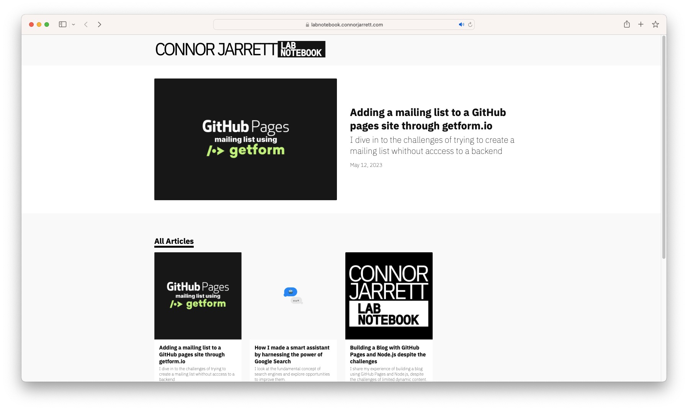
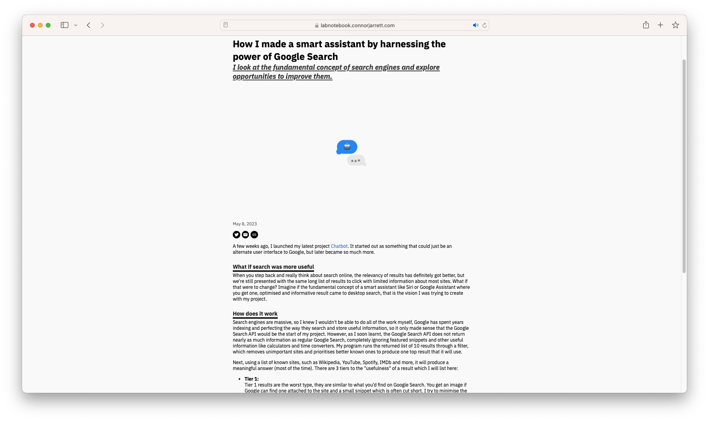

<!-- Hero -->
<h1 align="center">Lab Notebook</h1>

My personal blog where I share what I'm working on, what I'm learning, the places I go and the people I meet.

<a href="https://labnotebook.connorjarrett.com">

</a>

  

### What's it for?

Lab Notebook is my way of sharing what I'm doing and working on, without having to fit it in to a tweet or Git commit message. I wanted to share what I was working on without having to push a product with it, just so people can see the full detail behind some of my side projects.

<a href="https://labnotebook.connorjarrett.com">

</a>

Each article will include a little to a lot of information about something I've done in the past week, this could be big, like writing about the ongoing development of my blog, or working with APIs to create [Chatbot](https://labnotebook.connorjarrett.com/s/-13m6dmf?s=repo). Each one of my tweets and GitHub readmes will probably come linked with a blog post to describe in more detail what I've done.

 

### How often?

I hope to update quite regularly, I'm experimenting with a post a week, especially while it's new and unknown. This may slow down over time, but I definitely want to post when I release something big.

 

## Reach Out

If you want to get in contact with me for whatever reason, you can find me on Twitter [@ConnorJrt](https://twitter.com/ConnorJrt), or I can be contacted via email at [connor@connorjarrett.com](mailto:connor@connorjarrett.com)

 

### Some articles to get you started

- [Building a blog with GitHub Pages and Node.js despite the challenges](https://labnotebook.connorjarrett.com/s/scvexq?s=repo) 
- [How I made a smart assistant by harnessing the power of Google Search](https://labnotebook.connorjarrett.com/s/-13m6dmf?s=repo)
- [Adding a mailing list to a GitHub Pages site through getform.io](https://labnotebook.connorjarrett.com/s/-dlvgp3?s=repo)

If you've read something you enjoyed, please consider sharing the article with someone you think would find it interesting.